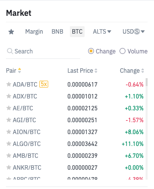

The small test that we would like you to do is to make your own market widget UI on React using the REST API and WebSockets as follow picture shows.

Rest API: `https://www.binance.com/exchange-api/v1/public/asset-service/product/get-products`

Here is some explanation of  get-products API:
| s  | symbol                        |
|----|-------------------------------|
| b  | base asset                    |
| q  | quote asset                   |
| o  | open price                    |
| h  | high price                    |
| l  | low price                     |
| c  | latest price                  |
| pm | parent market                 |
| pn | category of the parent market |

For example, ALTS has three categories,  XRP, ETH, and TRX. By choosing ALTS, it shows all the symbols in which the parent market is ALTS. By choosing ETH, it shows all the symbol which pm is ALTS and category is ETH.

WebSocket API: `wss://stream.binance.com/stream?streams=!miniTicker@arr`

There should also be a button that, once clicked, force closes the WebSocket, so you have to develop a proper retry/reconnect/resubscribe logic.

You need to group the coins into serveral markets

You should spend around half a day on this exercise. You can use JS or TypeScript and add at least one e2e test for this component.
