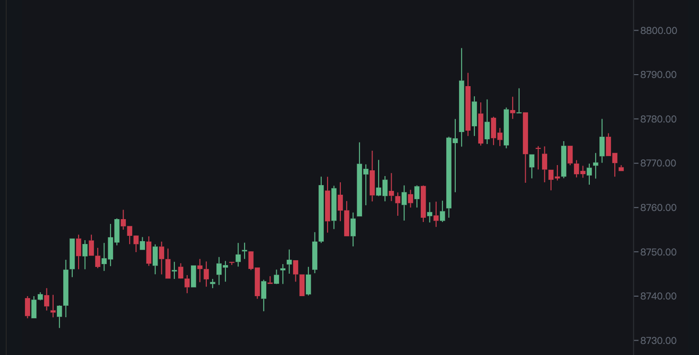

The small test that we would like you to do is to make your own kline based on Canvas using the REST API and WebSockets as follow picture shows.

Rest API: `https://www.binance.com/api/v1/klines?symbol=BTCUSDT&interval=1m`

Each item of dat returned by api represents the price of that timestamp, the first few items in the array are time,opening price,highest price,lowest price and closing price. The highest point of a k-line bar represents the highest price,the lowest point represents the lowest price. if the opening price is greater than the closing price, it represents price rasing up which is green.

WebSocket API: `wss://stream.binance.com/stream?streams=btcusdt@kline_1m`

API requests and sockets have examples in the code. You should do the following function:

First, drawing k-line based on historical data which indludes y-axis.

Second, drawing the latest bar based on socket data which should consider the performance of rendering

You should spend around half a day on this exercise. You can use some packages for data processing, such as big.js,lodash,but can't use canvas labraries.
